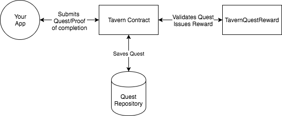

# Tavern

An Ethereum Smart Contract system that allows apps to create and complete Quests. A Quest is a task where users try to guess the Quest answer based on the Quest name and hint provided by the Quest creator.

By using Tavern you can easily integrate your own Token contract (ERC-721, ERC-20, or any contract at all), and issue any kind of rewards appropriate to your app.

Below you can find the addresses for the different network Taverns.

1. MainNet's Tavern: TBA
2. Rinkeby's Tavern: `0xcd4b7ed0c227fa259e8851fafed9bc88430eebab`

## How it works

Please see the following graphic for a diagram on how Tavern works:



## Quest Life Cycle

Every Quest has 2 major events on it's lifecycle: `Creation` and `Proving`.

### Quest creation
Creation is when an account creates a Quest, by using the `createQuest` function in the `Tavern` contract. During creation, a Quest is validated by the `TavernQuestReward` via the `validateQuest`, if the Quest gets marked as `valid`, then it can be proved in the next step of the lifecycle. A Quest can be validated post creation via the `validateQuest` function in the `Tavern` contract.

### Quest proving
`Proving` is when an account, different to the Quest creator, submits the necessary proof to be a Quest Winner. If the proof submitted is correct, the `Tavern` will call upon the `TavernQuestReward` to reward that Winner, and record the claim. A Quest reward can be claimed at a later stage after proving the Quest, via the `claimReward` in the `Tavern` contract.

## Connecting your App to a Tavern

### Pre-requisites

1. You need to create and deploy your own `TavernQuestReward`, which the `Tavern` contract is going to use to identify your app Quests from other apps. You must use the `TavernQuestReward` interface [here](https://github.com/pokt-network/tavern/blob/master/contracts/TavernQuestReward.sol) in your contract to be compatible with `Tavern`.

2. Any given quest must have more than 1 valid answer, because `Tavern` uses Merkle Trees to prove the Quests answers. You can read more on Merkle Trees [here](https://en.wikipedia.org/wiki/Merkle_tree).

### Creating the Merkle Tree
The first thing you need to make sure is that you're able to provide a list of valid of valid answers for your Quest, for example the [Banano Quest app](https://github.com/pokt-network/banano-quest) uses all the GPS coordinates pairs in a radius as a valid answer for an AR BANANO finding experience.

### Creating a Quest
To create a Quest you need to submit a transaction to the following function in the `Tavern` contract:

```
function createQuest(address _tokenAddress, string _name, string _hint, uint _maxWinners, bytes32 _merkleRoot, string _merkleBody, string _metadata) public payable
```

The `_merkleRoot` parameter must correspond to the Merkle Root of your Answer Merkle Tree. The `_merkleBody` parameter can be optionally used to store every level below the root, except the lowest level as that would equate to the Quest creator storing the possible answers in the `Tavern` contract Quest repository.

This function will try to validate the Quest by using the `validateQuest` function in your `TavernQuestReward` contract found in the `_tokenAddress` parameter provided when creating your Quest.

The function is `payable` with the purpose of being able to assign an Ether prize to the winners of the Quest, in which case the `_maxWinners` parameter must be greater than 0.
[Pocket, INC](https://pokt.network) as operators of the `Tavern` charge a 10% of all Quests created on the contracts specified in the addresses above. If you would prefer to operate your own custom `Tavern` you're able to do so by deploying the `Tavern` contract to your preferred Ethereum network.

### Validating a Quest
In case of a Quest being marked invalid by the `TavernQuestReward` contract, it can be revalidated by calling the following function in the `Tavern` contract:

```
function validateQuest(address _tokenAddress, uint _questIndex) public
```

### Submitting a Quest proof
To submit a Quest proof, users must send a transaction to the following function in the `Tavern` contract:

```
function submitProof(address _tokenAddress, uint _questIndex, bytes32[] _proof, bytes32 _answer) public
```

The `_proof` parameter is an array of all the hashes that conform the Merkle Proof by which the `_answer` leaf will be validated as a valid answer to the Quest.

This function will attempt to call the `rewardCompletion` function in the `TavernQuestReward` contract which resides in the `_tokenAddress` address.

### Claiming a Quest reward
In the case of the `TavernQuestReward` not providing the appropriate reward to the user upon proof submission, further reward claims can be done by calling the following function in the `Tavern` contract:

```
function claimReward(address _tokenAddress, uint _questIndex) public
```

### Fetching Quest related data from the Tavern contract
The `Tavern` contract exposes multiple getter methods that allow for easy retrieval of all Quest information necessary to create your App UI and UX.

## Known Attack Vectors

### Self-claiming quests
This attack consists of a Quest creator creating a Quest and completing it with a different account. Can be mitigated by adding a public trusted quest validator before giving out reward.

### Quest completion Sybil attack
When one person creates many other accounts to complete the same quest. Can be mitigated by adding a public trusted quest validator before giving out reward.
